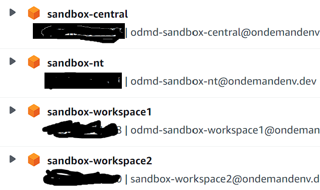

# ONDEMAND_build_contracts

This is ondemandenv.dev's example model:

4 aws accounts: https://github.com/ondemandenv/odmd-build-contracts/blob/0fa6afbe76e0468db447fcd9836d015bd30050bc/lib/OndemandContracts.ts#L80

sandbox implementation has 4 accounts when deployed
